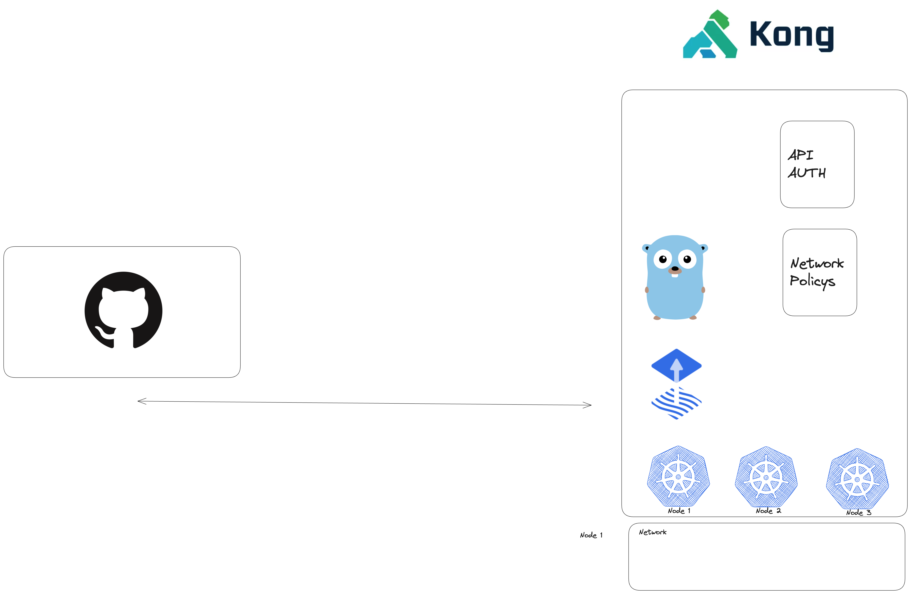

## Deployment Instructions

## Video & cluster access
video download: https://drive.google.com/file/d/15bWverCfSGDooJv_OXIk8pcfdXEW1dul/view?usp=sharing

kubeconfig access: https://drive.google.com/file/d/1mWkY860M-4nZz3dghbrbbNbmmhuIjMg4/view?usp=drive_link

### my thoughts 
[My Thoughts in a diagram](https://app.excalidraw.com/s/9eRoxrUweDS/8tfhFCpqjAA)

### Diagram 

### install 
1. `./scripts/bootstrap.sh`

2. enter pat 

### API TENANT 
located in `charts/phylax` is  a custom helm chart for deploying an api app wiht programatic access and network controls.

see `values.yaml` for example 